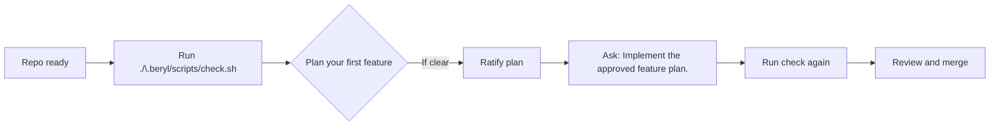

# Quickstart: from installed Beryl to first safe task

<p align="center">
  
</p>

## One goal

Get from **“I installed Beryl”** to **“I ran my first safe agent task”** with confidence, using only the repository’s canonical instructions and checks.

## Your first run in five scenes

You inherit a repo and hand it to Beryl's workflow. This is the sequence:

1. Read the contract surface once and trust the loop.
2. Let Beryl validate the repo state.
3. (Optionally) arm the local pre-commit guardrail.
4. Ask for a feature plan with a short prompt.
5. Ratify the plan.
6. Ask for implementation with one short prompt.



## Fast setup loop (commands you will actually run)

The paths and commands below are all from this repository:

| Step | Command or File | Why |
| --- | --- | --- |
| Validate current repository health | `./.beryl/scripts/check.sh` | Runs markdown checks, component checks, test-change checks, and project checks |
| Install Beryl into another repo | `./.beryl/scripts/setup-project.sh /path/to/project` | Installs control-plane files and optional hook setup |
| Install with driver workflows | `./.beryl/scripts/setup-project.sh --profile full /path/to/project` | Installs `.beryl/driver/` and `run.sh` for driver-based tasks |
| Bootstrap repo-specific context | `./.beryl/scripts/setup-project.sh --bootstrap /path/to/project` | Runs controlled headless bootstrap for `.beryl/agent/*.md` |
| Bootstrap with install flow | `sh beryl-install.sh --profile standard --bootstrap-agent` | Optional install-time bootstrap after `seed-agent-context` |
| Optional local guardrail | `git config core.hooksPath .beryl/githooks` | Runs `./.beryl/scripts/check.sh` on staged changes |
| Workflow rules | `.beryl/agent/task-routing.md` | Chooses the right workflow from user intent |
| Feature workflow | `.beryl/agent/skills/adding-features/SKILL.md` | Defines the feature implementation loop |
| Planning workflow | `.beryl/agent/skills/planning/SKILL.md` | Defines how to ask for a plan before implementation |
| Check discipline | `.beryl/agent/testing-policy.md` | Documents the check commands this repo uses |
| Repo operating rules | `.beryl/agent/agent-rules.md` | Repository-specific editing and workflow defaults |

## Bare-prompt sequence (modern style)

Ask the agent for a plan using short prompts and repository-owned routes:

```text
Feature:
Create a docs-only update for first-run onboarding.

Expected behavior:
- Add one new quickstart doc at repository root.
- Update README with a prominent reference to it.
- Keep changes limited to docs and check pass.

Use .beryl/agent/task-routing.md and the planning workflow.
Present the plan for my approval. Do not implement yet.
```

After approval, send the implementation prompt:

```text
Implement the approved feature plan.
```

This is the default style after Task 07's contract auto-loading: short, explicit prompts, no copied operating-contract boilerplate.

## From readme to first task, in practice

For a first run with driver usage, prefer:

1. `./.beryl/scripts/setup-project.sh --profile full /path/to/project`
2. If you only choose `standard`/`minimal`, add `--components driver` (or `--profile full`) before running any `run.sh` flow.

1. In a repo you want to use with an agent, run:

   ```bash
   ./.beryl/scripts/check.sh
   ```

2. If needed, install Beryl into another repo:

   ```bash
   ./.beryl/scripts/setup-project.sh /path/to/new-project
   ```

3. Optionally keep guardrails on locally:

   ```bash
   git config core.hooksPath .beryl/githooks
   ```
   
   Run this from a Git repo root, and ensure `.git/config` is writable. In restricted environments, failure modes include:

   - `fatal: not a git repository (or any of the parent directories): .git`
   - `fatal: could not lock config file .git/config: Permission denied`

4. Run step 1 whenever you want a quick safety check before handing work to the agent.

If bootstrap is not available, inspect
`.beryl/agent/bootstrap-status.json` and rerun setup with a supported runner:

```bash
sh ./.beryl/scripts/setup-project.sh --bootstrap --agent-runner codex /path/to/project
```

You now have the exact same path the full workflow uses, just scaled to your first task.

## Where to go deeper

- [Cheatsheet.md](./Cheatsheet.md): full command and workflow reference (authoritative)
- [Practise.md](./Practise.md): applied usage examples
- [Theory.md](./Theory.md): design rationale and model
- [./.beryl/agent/task-routing.md](./.beryl/agent/task-routing.md): workflow selection
- [./.beryl/agent/skills/planning/SKILL.md](./.beryl/agent/skills/planning/SKILL.md): approved planning workflow
- [./.beryl/agent/skills/adding-features/SKILL.md](./.beryl/agent/skills/adding-features/SKILL.md): feature implementation workflow
- [./.beryl/agent/testing-policy.md](./.beryl/agent/testing-policy.md): deterministic check guidance
- [./.beryl/agent/agent-rules.md](./.beryl/agent/agent-rules.md): canonical repo operating rules
