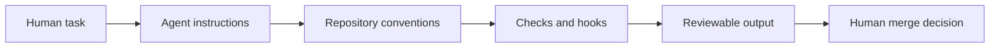

# Introduction: What Agentic Engineering Is Actually About

Agentic engineering starts from a simple observation: large language models are no longer just autocomplete systems. In many workflows, they behave more like interpreters. The "program" is not only code. It is the whole input you give the model: instructions, constraints, files, examples, tools, state, and environment. In that sense, the context window becomes the new execution surface.

That shift matters because it changes where software behavior comes from. In a traditional system, developers write deterministic code paths ahead of time and users operate within them. In an agentic system, some behavior is still encoded in code, but a meaningful part of the system is produced at runtime from language, context, and tool use. The practical question becomes less "what software do we ship?" and more "what capability do we give the agent, and how do we shape its judgment?"

This is the broader idea sometimes described as Software 3.0: software is increasingly specified in natural language and executed through models. The agent carries packaged intelligence and adapts its actions to the local environment. Instead of building a fixed application for every narrow workflow, you can often describe the task and get a bespoke solution for that situation.

That does not mean code disappears. It means code changes roles.

Deterministic software is still essential, but it increasingly serves as infrastructure, boundary, and tool. The neural network handles interpretation, synthesis, and adaptation. Conventional code handles persistence, permissions, computation, integration, testing, and enforcement. One is good at flexible reasoning under ambiguity. The other is good at reliable execution under rules. Useful systems need both.

This is why agentic engineering is not mainly about making software generation faster. Some of the value is speed, but the deeper change is that new kinds of systems become possible. Agents can inspect a codebase, form a plan, use tools, recover from intermediate failures, and adapt their approach to the environment. That is qualitatively different from ordinary automation.

The catch is equally important: these systems are stochastic. They can be useful, capable, and often impressive, but they are not inherently verifiable in the way ordinary programs are. The core research problem in this paradigm is not only capability. It is verifiability.

That is where engineering discipline re-enters the picture. If an agent can reason, improvise, and act, then the job of the engineer is to make those actions legible, bounded, and accountable. Prompting matters, but prompting alone is not enough. You need orchestration, evaluation, interfaces, tool design, environment control, testable boundaries, and reviewable outputs. In other words, the familiar ideas from software design do not become less important. They become more important.

This repository uses the term **agentic engineering** for that layer of work: the practice of building systems that use stochastic agents without surrendering responsibility for correctness, safety, and maintainability.

At a minimum, that means taking seriously a few obligations:

- Prevent obvious failure modes and unnecessary vulnerabilities.
- Keep responsibility for code and system behavior with humans, not with the model.
- Design for judgment, taste, and oversight rather than assuming the agent can supply them on demand.
- Build workflows that handle stochasticity well instead of pretending it is not there.

That is also why setup matters so much. Good results rarely come from "just asking the model." They come from investing in the surrounding structure: repository conventions, tool access, environment scaffolding, prompt patterns, evaluation loops, and clear operational boundaries. The quality of the setup often determines whether the agent behaves like a helpful engineer or an unreliable intern with shell access.

One of the current bottlenecks is infrastructure. Many agent-first workflows still break down at the boundary where the agent has to interact with real systems: hosting, deployment, secrets, permissions, observability, and production operations. The model may be capable of reasoning about the task, but the environment is often not yet shaped for agentic work.

So this repository is not built on the assumption that "AI will replace software." A better framing is narrower and more useful: the center of gravity is moving. More behavior will be specified in language. More systems will be assembled dynamically. More deterministic code will be used as tools around a reasoning core. And because of that, the engineering challenge is no longer just writing code. It is designing reliable systems around non-deterministic intelligence.

That is the problem space this repository is about.

## What This Repository Contains

This repository is an inspectable agentic-engineering workspace rather than a conventional app. It collects the operating rules, scripts, hooks, and review boundaries used to make agent-assisted development more reproducible.



Key paths:

- `agent/`: architecture notes, security policy, testing policy, task routing, and reusable agent context.
- `scripts/`: deterministic repository checks and manifest tooling.
- `githooks/`: pre-commit guardrails for local use.
- `tests/`: placeholder for behavior checks as the workflow becomes more concrete.

## Run The Checks

From the repository root:

```bash
./scripts/check.sh
```

The checks are intentionally lightweight and deterministic. Their job is to catch broken project structure and documentation drift before an agent-produced change reaches review.

## Current Status

This is a framework and operating-system repo for agentic coding practice. It is strongest as a proof-of-work artifact when paired with concrete case studies that show the workflow improving a real repository.

Interested in this area? Email me at praneeth.suresh.s@gmail.com.
