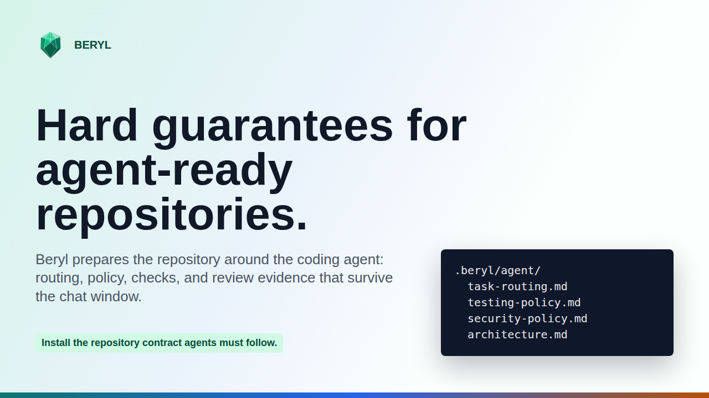
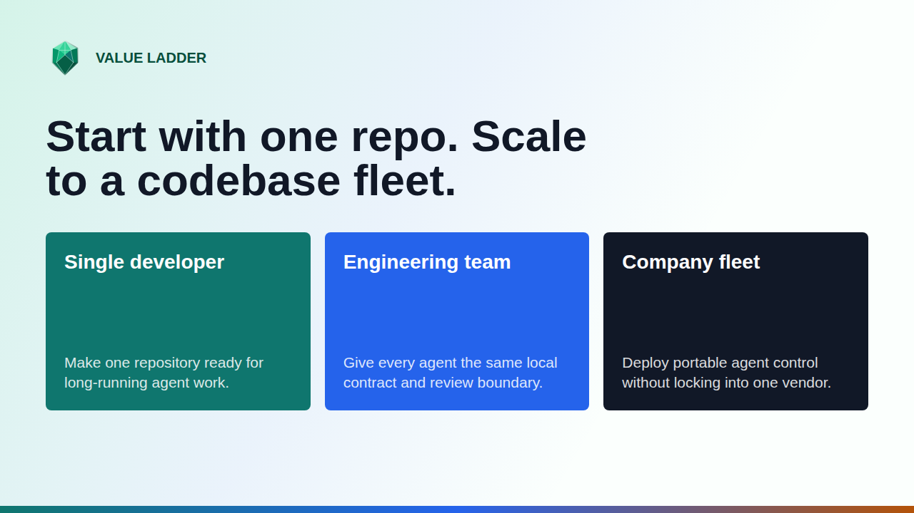

<p align="center">
  
</p>

<h1 align="center">Beryl</h1>

<p align="center">
  <strong>Make Repositories Ready For Agents</strong>
</p>

<p align="center">
  
  
  
  
</p>

<p align="center">
  
</p>

Beryl is a hard guarantee layer for AI-assisted development. It turns the agent workflow into files, checks, and review-ready boundaries before agent output is trusted.

You get repository-owned defaults for where the contract lives, how work is routed, and which checks run. Beryl does not replace review. It makes review and recovery easier.

## Quick Start

**Recommended first read:** [Quickstart.md](./Quickstart.md) — short, story-style onboarding from first read to first safe agent task.

### Set Up With a Coding Agent

Give your coding agent this prompt:

```text
Set up Beryl for this repository. Read and follow
.beryl/agent/skills/using-beryl/SKILL.md for the complete setup and working
instructions. Run the prescribed checks and report the results.
```

Recommended install: download and run the installer pinned to a ref you trust
(a tag or commit SHA instead of the moving `main`):

Linux/macOS:

```bash
BERYL_REF=main
curl --proto '=https' --tlsv1.2 -fsSL \
  https://raw.githubusercontent.com/Praneeth-Suresh/Beryl/main/install.sh -o beryl-install.sh
sh beryl-install.sh --ref "$BERYL_REF" --interactive
```

Windows: download in PowerShell, then run the installer from Git Bash or WSL
(native PowerShell execution is not supported):

```powershell
$env:BERYL_REF = "main"
Invoke-WebRequest `
  -Uri "https://raw.githubusercontent.com/Praneeth-Suresh/Beryl/main/install.sh" `
  -OutFile "beryl-install.sh"
bash -lc 'sh beryl-install.sh --ref "$BERYL_REF" --interactive'
```

For repeatable installs, replace `main` with a trusted tag or commit SHA before
running the command. The interactive command asks which component set to install,
including whether to include driver workflows, and whether a coding agent should
help fill Beryl project context.

Convenience one-liner (executes remote code without inspection — only use it
when you accept that trade-off):

```bash
curl -fsSL https://raw.githubusercontent.com/Praneeth-Suresh/Beryl/main/install.sh | sh
```

## The Three Commands That Matter

| Script | What it does |
| --- | --- |
| `install.sh` | Remote install entry point. It installs selected Beryl profiles or components into the current repository. |
| `.beryl/scripts/setup-project.sh` | Interactive onboarding for an existing or new project. It lets you choose the component set, including whether driver workflows are installed, and whether a coding agent should help fill project context. |
| `.beryl/scripts/check.sh` | Deterministic safety gate for Markdown, test-manifest integrity, and configured project checks. |

Install Beryl into another project interactively:

```bash
./.beryl/scripts/setup-project.sh /path/to/project
```

Run the primary repo safety gate:

```bash
./.beryl/scripts/check.sh
```

Detailed install flags, profiles, component examples, bootstrap controls, and
hook troubleshooting live in [.beryl/scripts/README.md](./.beryl/scripts/README.md).

## Documentation Map

Use this map before opening multiple files:

- User docs and references
  - [Quickstart.md](./Quickstart.md): Fast path to your first safe task.
  - [README.md](./README.md): Entry point and decision guide.
  - [Theory.md](./Theory.md): Goals, motivations, and project reasoning.
  - [Practise.md](./Practise.md): Applied examples.
  - [Cheatsheet.md](./Cheatsheet.md): Canonical command-and-workflow reference.
  - [RepositoryUpkeep.md](./RepositoryUpkeep.md): Tracked process for idea intake, material promotion, maintenance cadence, and upkeep verification.
  - [AgenticSecurity.md](./AgenticSecurity.md): Security controls, hardening status, and near-term roadmap for agentic coding workflows.
  - `current.md`: Ignored local scratch context; promote durable material into tracked docs instead.
  - [gitignore-sample.md](./gitignore-sample.md): Ignore pattern template.
  - [assets/brand/beryl-brand-guide.md](./assets/brand/beryl-brand-guide.md): Brand and messaging reference.
- Agent instruction surfaces
  - [AGENTS.md](./AGENTS.md): Runtime AGENTS shim; source edits should start from `.beryl/agent/tool-instruction-template.md`.
  - [CLAUDE.md](./CLAUDE.md): Runtime Claude shim; source edits should start from `.beryl/agent/tool-instruction-template.md`.
  - [.cursor/rules/agent-rules.md](./.cursor/rules/agent-rules.md): Runtime Cursor shim; source edits should start from `.beryl/agent/agent-rules.md`.
  - [.github/copilot-instructions.md](./.github/copilot-instructions.md): Runtime Copilot shim; source edits should start from `.beryl/agent/agent-rules.md`.
  - [.codex/AGENTS.md](./.codex/AGENTS.md): Runtime Codex shim; source edits should start from `.beryl/agent/agent-rules.md`.
  - [.github/workflows/deterministic-checks.yml](./.github/workflows/deterministic-checks.yml): deterministic CI entrypoint.
- Reference, design, and operational material
  - [.beryl/agent/task-routing.md](./.beryl/agent/task-routing.md): Route each request to the correct workflow.
  - [.beryl/agent/project-brief.md](./.beryl/agent/project-brief.md): Product goal and scope.
  - [.beryl/agent/design-tree.md](./.beryl/agent/design-tree.md): Evolving and settled design notes.
  - [.beryl/agent/architecture.md](./.beryl/agent/architecture.md): Bounded-context ownership.
  - [.beryl/agent/ubiquitous-language.md](./.beryl/agent/ubiquitous-language.md): Canonical project vocabulary.
  - [.beryl/agent/testing-policy.md](./.beryl/agent/testing-policy.md): Check commands and testing expectations.
  - [.beryl/agent/agent-rules.md](./.beryl/agent/agent-rules.md): Repo-level operating defaults.
  - [.beryl/agent/skills/adding-features/SKILL.md](./.beryl/agent/skills/adding-features/SKILL.md): Approved feature implementation path.
  - [.beryl/agent/skills/planning/SKILL.md](./.beryl/agent/skills/planning/SKILL.md): Planning workflow.
  - [.beryl/agent/skills/debugging/SKILL.md](./.beryl/agent/skills/debugging/SKILL.md): Debug workflow.
  - [.beryl/driver/README.md](./.beryl/driver/README.md): Driver behavior and session flow.
  - [.beryl/agent/README.md](./.beryl/agent/README.md): Source-of-truth index for agent contexts.

## Operating Model

| Layer                | Purpose                                                |
| -------------------- | ------------------------------------------------------ |
| Human intent         | Defines the desired outcome                            |
| Agent routing        | Selects the right workflow before edits                |
| Repository rules     | Provides the persistent contract from`.beryl/agent/` |
| Deterministic checks | Verifies edits through`./.beryl/scripts/check.sh`    |
| Human review         | Keeps final ownership with the user                    |

## Value Ladder

Beryl starts as a practical safety layer for one repository, then scales without changing the operating model:

<p align="center">
  
</p>

## Origin

Beryl started as a practical answer to unattended agent runs that were hard to supervise. The repository now carries the control plane so the process is explicit, repeated, and reviewable.

Interested in this area? Email me at praneeth.suresh.s@gmail.com.
