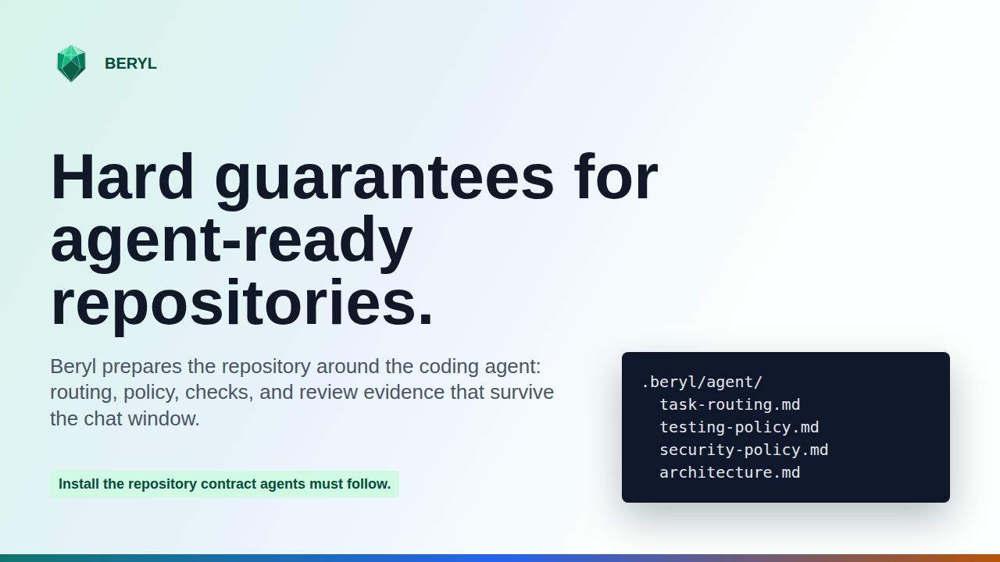

<p align="center">
  
</p>

<h1 align="center">Beryl</h1>

<p align="center">
  <strong>Make Repositories Ready For Agents</strong>
</p>

<p align="center">
  
  
  
  
  
</p>

<p align="center">
  
</p>

Beryl is a hard guarantee layer for AI-assisted development. It turns the agent workflow into files, checks, and review-ready boundaries before agent output is trusted.

You get repository-owned defaults for where the contract lives, how work is routed, and which checks run. Beryl does not replace review. It makes review and recovery easier.

## Open Source License

Beryl is open source under the [Apache License, Version 2.0](./LICENSE).
You may use, modify, redistribute, and commercialize Beryl. When distributing
it or derivative works, preserve the license and applicable notices, identify
modified files, and follow the [NOTICE](./NOTICE) requirements. Apache-2.0 also
includes an express patent license and patent-termination provision; read the
full license for its terms, conditions, warranty disclaimer, and limitation of
liability.

The license does not grant rights to use the Beryl name or logos beyond normal
descriptive use. See [TRADEMARKS.md](./TRADEMARKS.md).

## Community, Support, and Services

- [Contribute](./CONTRIBUTING.md) code or documentation under Apache-2.0.
- Get best-effort community help through [Support](./SUPPORT.md), or report a
  vulnerability through the [Security Policy](./SECURITY.md).
- Beryl remains free and open source; [consulting services](./SERVICES.md)
  provide tailored setup, migrations, governance design, training, audits, and
  ongoing advisory support.

## Quick Start

**Recommended first read:** [Quickstart.md](./Quickstart.md) for the shortest
walkthrough from first read to first safe agent task.

### Choose A Setup Workflow

- [What You Can Do With Beryl](#what-you-can-do-with-beryl): understand the
  installed workflow before choosing commands.
- [Set Up With a Coding Agent](#set-up-with-a-coding-agent): best when you
  want the agent to install Beryl and consolidate existing agent instructions.
- [Install Directly](#install-directly): best when you want to run the
  installer yourself.
- [Use a Local Beryl Checkout](#use-a-local-beryl-checkout): best when you
  already have this repository on disk.
- [Update an Existing Installation](#update-an-existing-installation): safely
  retrieve current Beryl features without replacing target-owned context.
- [Run Checks](#run-checks): verify the installed repository.

### Set Up With A Coding Agent

Open your target repository in your coding agent. Do not clone Beryl first.
Give the agent this prompt:

```text
Set up Beryl for this repository.

First ask me for the trusted Beryl full 40-character commit SHA and matching
archive SHA-256. Fetch and read the
matching setup skill at:
https://raw.githubusercontent.com/Praneeth-Suresh/Beryl/<trusted-ref>/.beryl/agent/skills/using-beryl/SKILL.md

Follow it exactly. Install Beryl into the current repository without cloning
Beryl. If this repo already has code, tests, docs, or agent instruction files,
preserve them, then consolidate durable agent guidance into Beryl's
.beryl/agent/ files. Ask before replacing existing root instruction files with
Beryl-managed shims. Run the prescribed checks and report changed files,
preserved files, conflicts, and results.
```

Remote lifecycle commands require a full 40-character commit SHA, never a tag
or moving branch.

### Install Directly

Download the installer for a trusted, immutable release commit, inspect it,
then run it. Remote lifecycle commands require both a full 40-character commit
SHA and that commit's archive SHA-256 from Beryl's trusted release channel. Do
not pipe a download into a shell.

Find the pair in the matching [GitHub Release checksum asset](https://github.com/Praneeth-Suresh/Beryl/releases): each published release includes
`beryl-<full-sha>.tar.gz.sha256`, whose filename carries the full commit SHA and
whose content is the archive digest.

Linux/macOS:

```bash
BERYL_REF='0123456789abcdef0123456789abcdef01234567' # full 40-character commit SHA
BERYL_ARCHIVE_SHA256='replace-with-trusted-release-digest'
curl --fail --show-error --location --proto '=https' --proto-redir '=https' --tlsv1.2 \
  "https://raw.githubusercontent.com/Praneeth-Suresh/Beryl/${BERYL_REF}/install.sh" \
  -o beryl-install.sh
less beryl-install.sh
sh beryl-install.sh --ref "$BERYL_REF" --expected-sha256 "$BERYL_ARCHIVE_SHA256" --interactive
```

Windows: download in PowerShell, then run the installer from Git Bash or WSL
(native PowerShell execution is not supported):

```powershell
$env:BERYL_REF = "0123456789abcdef0123456789abcdef01234567" # full 40-character commit SHA
$env:BERYL_ARCHIVE_SHA256 = "replace-with-trusted-release-digest"
Invoke-WebRequest `
  -Uri "https://raw.githubusercontent.com/Praneeth-Suresh/Beryl/$env:BERYL_REF/install.sh" `
  -MaximumRedirection 0 `
  -OutFile "beryl-install.sh"
bash -lc 'less beryl-install.sh && sh beryl-install.sh --ref "$BERYL_REF" --expected-sha256 "$BERYL_ARCHIVE_SHA256" --interactive'
```

`Invoke-WebRequest -MaximumRedirection 0` refuses redirects; the URL itself is
HTTPS. Native PowerShell only downloads the POSIX installer—run it from Git
Bash or WSL.

### Use A Local Beryl Checkout

If you already have Beryl checked out locally, install it into another project.
`--source-dir` is for a Git checkout only: Beryl stages its tracked release
files and refuses arbitrary directories.

```bash
./.beryl/scripts/setup-project.sh /path/to/project
```

### Update An Existing Installation

An update requires the existing target's `.beryl/lock.json`. With no `--ref`,
`--expected-sha256`, `--profile`, or `--components`, it reuses the lockfile's
immutable source ref, `expectedSourceSha256`, and requested components.
Passing source or component options is an explicit replacement; a new remote
`--ref` must be a full 40-character commit SHA with explicit matching digest:

```bash
BERYL_REF='0123456789abcdef0123456789abcdef01234567'
BERYL_ARCHIVE_SHA256='replace-with-trusted-release-digest'
sh beryl-install.sh --ref "$BERYL_REF" --expected-sha256 "$BERYL_ARCHIVE_SHA256" \
  --update --target /path/to/project
```

Use `--profile` or `--components` only when deliberately replacing the
requested component selection. A digest-protected update refuses to continue
if the reused `expectedSourceSha256` is absent or differs from the downloaded
archive. For a remote replacement, provide the selected full SHA and matching
archive digest from a trusted release channel.

The update stages and validates the selected release before applying it. Its
managed-path ledger is state, not deletion authority: normally deselected or
ambiguous managed files are preserved and removed from Beryl's ownership ledger,
along with target-owned project context, configuration, driver tasks/state, and
unknown user files.
Successful updates retain replaced files below `.beryl/.updates/<timestamp>/`.
If an update fails, its diagnostic names the phase, component, path, reason,
and rollback result.

Normal updates preserve deselected ambiguous files and remove them from Beryl's
ownership ledger; a selection change is never cleanup authorization.

### Recover Or Remove An Installation

Recovery is intentionally conservative. A retained update backup can be
restored only when Beryl can prove the current release source; provide a Git
checkout of that current source with `--current-source-dir` when required.
Restore also requires explicit historical `--profile`/`--components`, plus
explicit `--current-profile`/`--current-components` before it can remove a
current-only path. Remote recovery validates the locked full SHA and archive
digest before fetching. Uninstall removes only explicitly selected, unchanged,
digest-proven managed paths and restores Beryl-owned Git hook configuration.
Adoption records an identical unlocked Beryl surface; it never replaces unknown
target files.

```bash
# Restore a backup shown by the successful update summary.
BERYL_REF='0123456789abcdef0123456789abcdef01234567'
BERYL_ARCHIVE_SHA256='replace-with-trusted-release-digest'
sh beryl-install.sh --restore <backup-id> --ref "$BERYL_REF" \
  --expected-sha256 "$BERYL_ARCHIVE_SHA256" --target /path/to/project \
  --profile standard --current-profile full \
  --current-source-dir /path/to/current-beryl-git-checkout

# Remove only explicitly selected Beryl-owned, unchanged files (refuses
# modified, unknown, or unselected paths).
sh beryl-install.sh --uninstall --ref "$BERYL_REF" \
  --expected-sha256 "$BERYL_ARCHIVE_SHA256" --profile full \
  --target /path/to/project

# Record a matching, unlocked Beryl installation without overwriting it. With
# no profile/components, Beryl infers only minimal, standard, or full from
# distinctive files and refuses ambiguous or partial surfaces.
sh beryl-install.sh --adopt-existing --source-dir /path/to/beryl-git-checkout \
  --target /path/to/project
```

### Run Checks

From the installed repository:

```bash
./.beryl/scripts/check.sh
```

## What You Can Do With Beryl

Beryl gives your repo a visible agent workflow instead of relying on chat
memory or one-off prompts.

| Need | What Beryl provides |
| --- | --- |
| Add Beryl to an existing repo | Remote install, local setup, component profiles, and conflict-preserving root shims. |
| Tell agents how to work | `.beryl/agent/task-routing.md` routes each request to planning, feature work, debugging, or explanation. |
| Require plans before edits | The planning and feature skills make agents present a plan, success checks, and commit boundaries before implementation. |
| Preserve project knowledge | `.beryl/agent/` stores the project brief, architecture, testing policy, vocabulary, and durable agent rules. |
| Verify agent changes | `./.beryl/scripts/check.sh` runs Markdown, component, secret, test-manifest, and project checks. |
| Keep local guardrails | Optional githooks run the deterministic gate before commits. |
| Run larger task workflows | The full profile installs `.beryl/driver/` for driver-managed task loops. |

The normal loop is short: install Beryl, run `./.beryl/scripts/check.sh`, ask
the agent for a plan, approve the plan, let it implement, rerun checks, then
review the diff.

## Command Reference

| Script                              | What it does                                                                                                                                                                                                |
| ----------------------------------- | ----------------------------------------------------------------------------------------------------------------------------------------------------------------------------------------------------------- |
| `install.sh`                      | Lifecycle entry point: install, locked update, restore, conservative uninstall, explicit adoption, and standalone bootstrap. |
| `.beryl/scripts/setup-project.sh` | Interactive or `--non-interactive` local frontend that delegates one normalized install/update transaction. |
| `.beryl/scripts/check.sh`         | Deterministic safety gate for Markdown, test-manifest integrity, and configured project checks.                                                                                                             |

Detailed install flags, profiles, component examples, bootstrap controls, and
hook troubleshooting live in [.beryl/scripts/README.md](./.beryl/scripts/README.md).
The CI `lifecycle-regressions` job runs
`./.beryl/scripts/run-lifecycle-tests.sh`; run that same command before
publishing a lifecycle change.

## Operating Model

Beryl turns an agent request into a repo-owned loop:

| Layer | What it gives you |
| --- | --- |
| Human intent | You state the outcome, constraints, and approval points. |
| Agent routing | `.beryl/agent/task-routing.md` chooses planning, feature work, debugging, or explanation before edits begin. |
| Repository rules | `.beryl/agent/` stores the project brief, architecture, testing policy, workflow skills, and generated root shims. |
| Deterministic checks | `./.beryl/scripts/check.sh` runs the repeatable safety gate before review. |
| Human review | You approve plans, inspect diffs, and decide what merges. |

## Value Ladder

Beryl starts as a practical safety layer for one repository, then scales without changing the operating model:

<p align="center">
  
</p>

## Origin

Beryl started as a practical answer to unattended agent runs that were hard to supervise. The repository now carries the control plane so the process is explicit, repeated, and reviewable.

Interested in this area? Email me at praneeth.suresh.s@gmail.com.
## Conflicts, Hooks, And Readiness

Initial installs refuse existing unlocked `.beryl` directories, symlinks, root
contract conflicts, and existing Git hook ownership by default. Choose a
documented explicit policy only after inspecting the target:
`--root-conflict fail|skip|overwrite` and, with `--enable-githooks`,
`--hook-conflict fail|preserve|replace`. The selected policies are recorded in
the lockfile. A preserved root contract or hook is reported as an external
contract rather than silently treated as Beryl enforcement.

`--bootstrap-agent` is standalone: run it only after a successful locked
install or update. Bootstrap changes are outside Beryl's file transaction and
its success or failure is reported separately.
